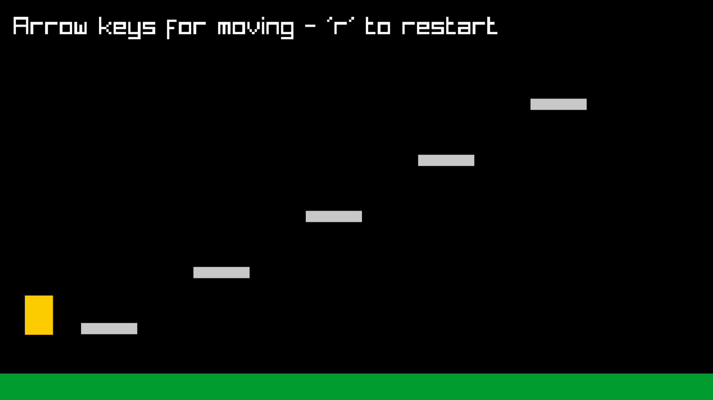

# Game 01 - Platform game (work in progress)



## Dependencies
- Raylib
- CMake

## Instructions
Use those two scripts:
``` bash
$ ./BUILD.sh
$ ./RUN.sh
```

To run on WSL, start **VcXsrv X Server** using *config.xlaunch* before starting
the program from a WSL console.

Use the debug configuration in .vscode for debugging in VSCode.
