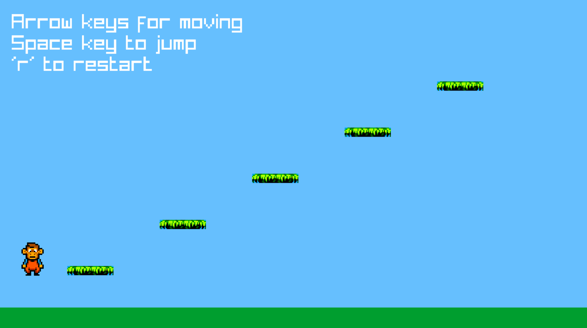

# Game 01 - Platform game (work in progress)

## Dependencies
- GCC (supporting C++23)
- Raylib (works on 5.6)
- CMake (works on 3.28.3)

## Instructions
Use these two scripts:
``` bash
$ ./BUILD.sh
$ ./RUN.sh
```
or use the scripts in the .vscode folder.

To run on WSL, start **VcXsrv X Server** using *config.xlaunch* before starting
the program from a WSL console.

## Updates

27/12/2024:
<p></p>

26/12/2024:
<p></p>
